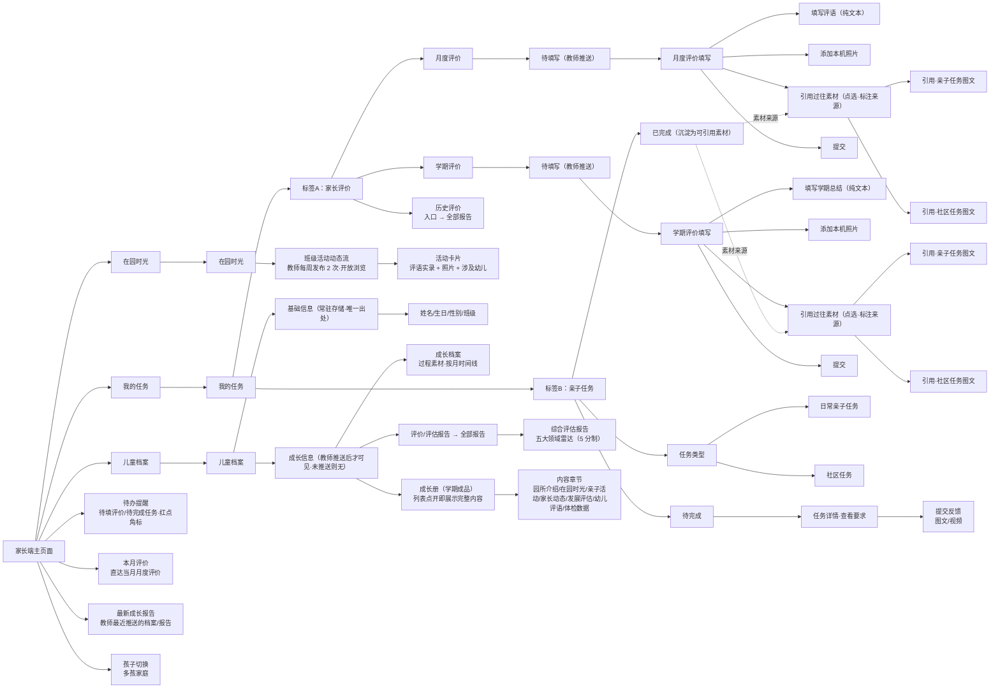

# 化龙幼儿园 · 家长端 信息架构

> 家长端手机原型。底部常驻导航四项：**首页 / 我的任务 / 在园时光 / 儿童档案**。
> 家长评价（月度/学期）为**纯文本评语 + 照片**，与教师端发布口径一致，不含维度打分。

## 底部导航

| Tab | 目标屏 | 说明 |
| --- | --- | --- |
| 首页 | `screens/home.html` | 待办提醒、本月评价直达、最新成长报告、孩子切换 |
| 我的任务 | `screens/evaluation-tasks.html` | 家长评价 ⇄ 亲子任务（顶部分段切换） |
| 在园时光 | `screens/kindergarten-moments.html` | 班级动态流（开放浏览） |
| 儿童档案 | `screens/child-profile.html` | 基础信息 + 成长档案/报告/成长册入口 |

详情页与填写页（评价填写、任务详情、历史详情、切换孩子）不带底部导航，使用返回键；跨入口进入的详情页通过 `?from=` 参数动态回退。
