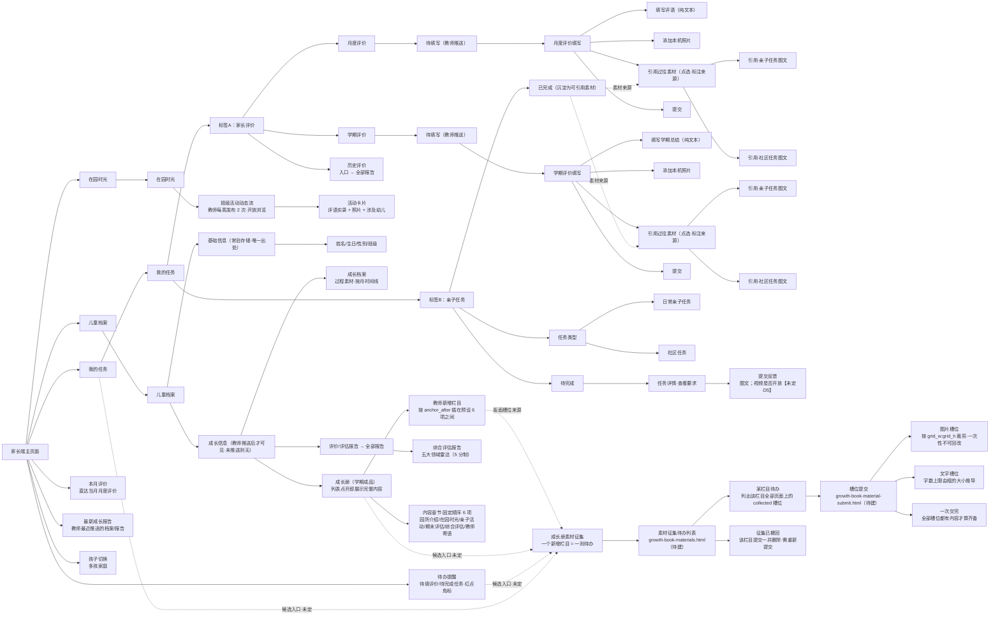

# 化龙幼儿园 · 家长端 信息架构

> 家长端手机原型。底部常驻导航四项：**首页 / 我的任务 / 在园时光 / 儿童档案**。
> 家长评价（月度/学期）为**纯文本评语 + 照片**，与教师端发布口径一致，不含维度打分。

```mermaid
flowchart LR
    Home["家长端主页面"]

    %% ========== 主页面：一级入口 ==========
    Home --> NavTask["我的任务"]
    Home --> NavChild["儿童档案"]
    Home --> NavMoments["在园时光"]
    Home --> EntryTodo["待办提醒<br/>待填评价/待完成任务·红点角标"]
    Home --> EntryMonthly["本月评价<br/>直达当月月度评价"]
    Home --> EntryReport["最新成长报告<br/>教师最近推送的档案/报告"]
    Home --> EntryChildSwitch["孩子切换<br/>多孩家庭"]

    %% ========================================
    %% 我的任务
    %% ========================================
    NavTask --> Task["我的任务"]
    Task --> TabEval["标签A：家长评价"]
    Task --> TabParent["标签B：亲子任务"]

    %% ---------- 标签A：家长评价（月度/学期） ----------
    TabEval --> EvalMonthly["月度评价"]
    TabEval --> EvalTerm["学期评价"]
    TabEval --> EvalHistory["历史评价<br/>入口 → 全部报告"]
    %% 月度与学期评价填写结构一致：纯文本评语 + 本机照片 + 引用过往素材

    %% --- 月度评价 ---
    EvalMonthly --> MTodo["待填写（教师推送）"]
    MTodo --> MForm["月度评价填写"]
    MForm --> MWrite["填写评语（纯文本）"]
    MForm --> MPhoto["添加本机照片"]
    MForm --> MQuote["引用过往素材（点选·标注来源）"]
    MQuote --> MFromParentTask["引用·亲子任务图文"]
    MQuote --> MFromCommunity["引用·社区任务图文"]
    MForm --> MSubmit["提交"]

    %% --- 学期评价 ---
    EvalTerm --> TTodo["待填写（教师推送）"]
    TTodo --> TForm["学期评价填写"]
    TForm --> TWrite["填写学期总结（纯文本）"]
    TForm --> TPhoto["添加本机照片"]
    TForm --> TQuote["引用过往素材（点选·标注来源）"]
    TQuote --> TFromParentTask["引用·亲子任务图文"]
    TQuote --> TFromCommunity["引用·社区任务图文"]
    TForm --> TSubmit["提交"]

    %% ---------- 标签B：亲子任务 ----------
    TabParent --> PTaskType["任务类型"]
    PTaskType --> PDaily["日常亲子任务"]
    PTaskType --> PCommunity["社区任务"]
    TabParent --> PTodo["待完成"]
    TabParent --> PDone["已完成（沉淀为可引用素材）"]
    PTodo --> PDetail["任务详情·查看要求"]
    PDetail --> PSubmit["提交反馈<br/>图文；视频是否开放【未定·D5】"]

    %% ========================================
    %% 在园时光（教师端家园共育推送）
    %% ========================================
    NavMoments --> Moments["在园时光"]
    Moments --> MomentFeed["班级活动动态流<br/>教师每周发布 2 次·开放浏览"]
    MomentFeed --> MomentCard["活动卡片<br/>评语实录 + 照片 + 涉及幼儿"]

    %% ========================================
    %% 儿童档案
    %% ========================================
    NavChild --> Child["儿童档案"]
    Child --> ChildBasic["基础信息（常驻存储·唯一出处）"]
    ChildBasic --> BasicFields["姓名/生日/性别/班级"]

    Child --> ChildPushed["成长信息（教师推送后才可见·未推送则无）"]
    ChildPushed --> GrowthRecord["成长档案<br/>过程素材·按月时间线"]
    ChildPushed --> EvalReport["评价/评估报告 → 全部报告"]
    EvalReport --> ReportSummary["综合评估报告<br/>五大领域雷达（5 分制）"]
    ChildPushed --> GrowthBook["成长册（学期成品）<br/>列表点开即展示完整内容"]
    GrowthBook --> BookItems["内容章节·固定顺序 6 项<br/>园所介绍/在园时光/亲子活动/期末评估/综合评估/教师寄语"]
    GrowthBook --> BookCustom["教师新增栏目<br/>按 anchor_after 插在预设 6 项之间"]

    %% ========================================
    %% 成长册素材征集（教师新增栏目 → 家长端待办）
    %% 入口挂在哪个一级导航【未定】，见下方「成长册素材征集（待建）」
    %% ========================================
    BookMaterial["成长册素材征集<br/>一个新增栏目 = 一则待办"]
    BookMaterial --> BMList["素材征集待办列表<br/>growth-book-materials.html（待建）"]
    BMList --> BMSection["某栏目待办<br/>列出该栏目全部页面上的 collected 槽位"]
    BMSection --> BMSubmit["槽位提交<br/>growth-book-material-submit.html（待建）"]
    BMSubmit --> BMPhoto["图片槽位<br/>按 grid_w:grid_h 裁剪·一次性不可回改"]
    BMSubmit --> BMText["文字槽位<br/>字数上限由框的大小推导"]
    BMSubmit --> BMFull["一次交完<br/>全部槽位都有内容才算齐备"]
    BMList --> BMWithdraw["征集已撤回<br/>该栏目提交一并删除·需重新提交"]
    BookCustom -. 版面槽位来源 .-> BookMaterial

    %% 候选入口三条，来自不同文件且未由 DECISIONS.md 拍板
    GrowthBook -. 候选入口·未定 .-> BookMaterial
    EntryTodo -. 候选入口·未定 .-> BookMaterial
    NavTask -. 候选入口·未定 .-> BookMaterial

    %% ========================================
    %% 数据流：素材逐级汇聚（虚线引用关系）
    %% ========================================
    PDone -. 素材来源 .-> MQuote
    PDone -. 素材来源 .-> TQuote
```

## 底部导航

| Tab | 目标屏 | 说明 |
| --- | --- | --- |
| 首页 | `screens/home.html` | 待办提醒、本月评价直达、最新成长报告、孩子切换 |
| 我的任务 | `screens/evaluation-tasks.html` | 家长评价 ⇄ 亲子任务（顶部分段切换） |
| 在园时光 | `screens/kindergarten-moments.html` | 班级动态流（开放浏览） |
| 儿童档案 | `screens/child-profile.html` | 基础信息 + 成长档案/报告/成长册入口 |

详情页与填写页（评价填写、任务详情、历史详情、切换孩子）不带底部导航，使用返回键；跨入口进入的详情页通过 `?from=` 参数动态回退。

## 成长册内容章节

`DECISIONS.md` E3 定内容组成为 6 项，顺序固定，家长端不可改、教师端也不提供整体拖拽排序：园所介绍（intro）→ 在园时光（time）→ 亲子活动（task）→ 期末评估（term）→ 综合评估（comp）→ 教师寄语（message）。相对旧版：删「家长动态」（家长评价仍在我的任务一线，不再进成长册），「发展评估」拆成期末评估与综合评估，「幼儿评语」更名教师寄语并改读 `db_teacher_message`；体检数据 B12 已砍，维持不变。哪几项启用由班级模版 `db_growth_book_template.enabled_sections` 决定，教师新增的栏目按 `anchor_after` 插在预设项之间。

## 成长册素材征集（待建）

`DECISIONS.md` E3 之下的 W15 定：教师新增的一个成长册栏目 = 家长端一则待办，点进去列出该栏目所有页面上的全部 `collected` 槽位，一次交完；不按 widget 发、也不按页发。齐备判定是该栏目全部槽位都有内容，不是至少交一件。征集不设时限、无逾期态，未交的槽位教师可代传；教师撤回征集时该栏目已收的提交一并删除，家长需重新提交。对应的 `screens/growth-book-materials.html` 与 `screens/growth-book-material-submit.html` 尚未建立，节点与字段定义见 [成长册规格](backend%20spec%20files/growth-book-spec.md)。

**入口挂在四个一级导航中的哪一个【未定】。** 现有两处来源不一致，`DECISIONS.md` 与 `db/GAPS.md` 均未正面拍板，实现前须先问，不得默默择一：

| 来源 | 主张的入口 |
| --- | --- |
| `docs/backend spec files/growth-book-spec.md` 静态节点 4 | 儿童档案 → 成长册 → 素材征集待办 |
| `decision.md` §1 所列页面 | 首页待办提醒 / 全部待办提醒 / 我的任务 |

## 视频入口

成长册的 widget 只有图片与文字两型，不做视频（W7），素材征集槽位同此。亲子任务提交页现存的「视频」入口不受 W7 约束，但视频在 v1 是否先在 UI 层禁止上传属 `DECISIONS.md` D5 的未拍板项（内容把关的覆盖范围与落点），图中已按未定标注，实现前不得自行开放或关闭。
